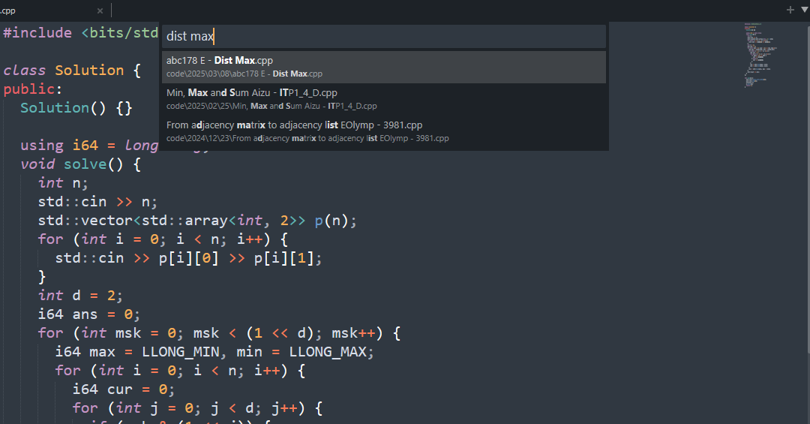
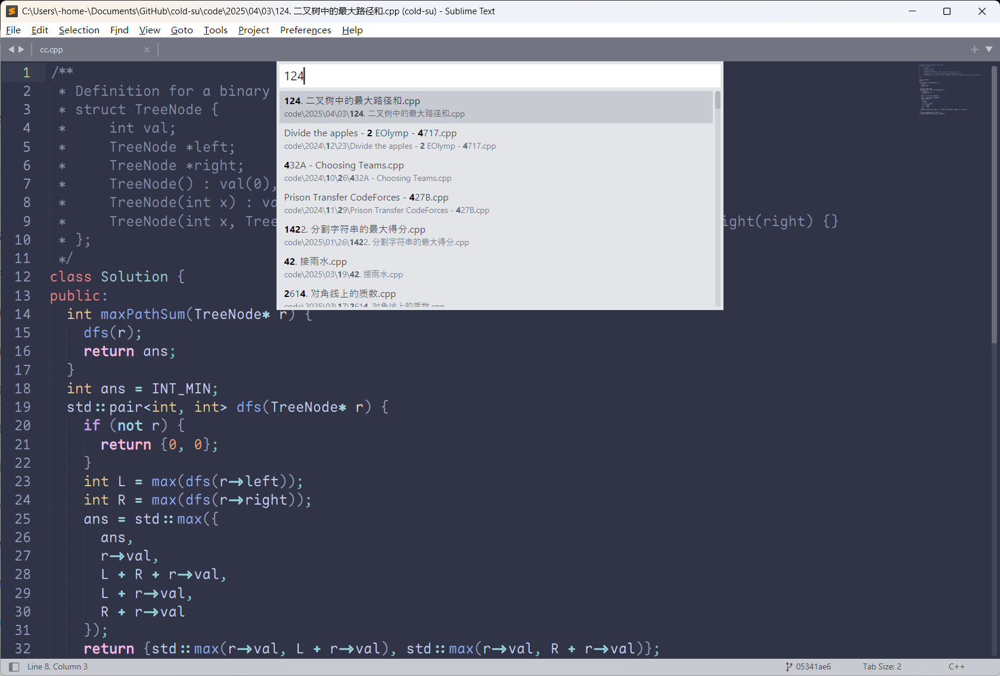
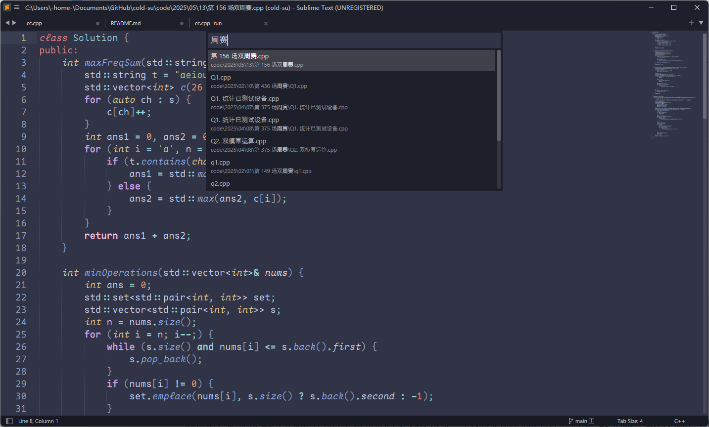

# 每日做题记录

**自 2025-06-05 起, 无期限暂停收录**

- **YYYY/MM/DD/**: 按时间顺序存档答案

- **lib**: Snippets 或者一些数据结构的实现

## 如何找到某份答案？

用 `Sublime text` 打开文件夹，`Ctrl + p` 打开控制台，输入题目名称。

**示例 1：**

输入 `dist max`，根据题目信息检索.

**示例 2：**

输入 `124`，根据力扣题号（或者其他题目的数字信息）检索。

**示例 3：**

输入 `周赛`，检索我的周赛提交存档.

