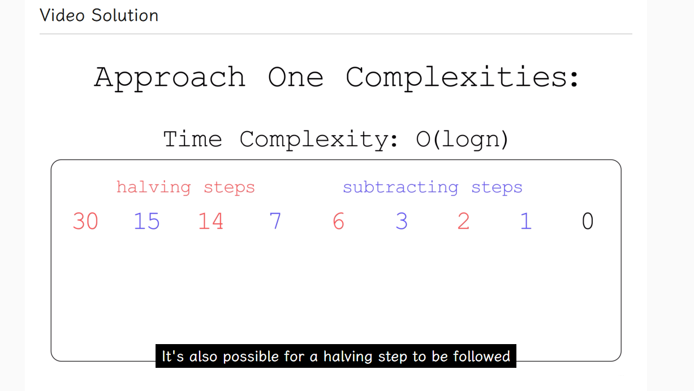
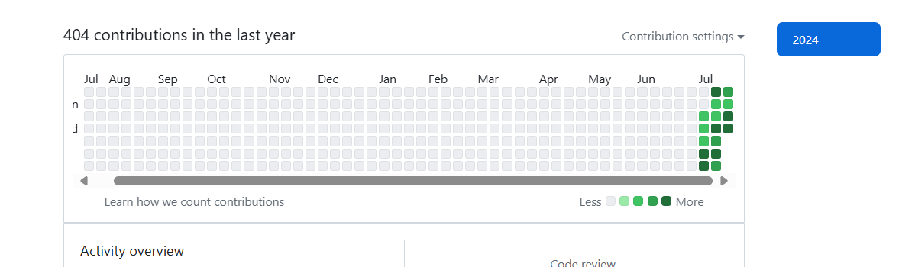

# 杂感

## 2024-08-21

### 我的三小时能拿来干什么？

如果给一个Linux开发者三个小时，他已经实现了一项功能了；如果给一位精通算法和程序设计的人三个小时，那么他绝对可以写出相当令人称奇的算法……

若要是给我三个小时呢？我可以说，我什么也做不到。

别说是做了，我连学三个小时都不知道有些什么好效果呢。

果然能力不足是样子的。

我突然羡慕起那些傻子们了，天天在网上发表弱智言论，自己都不知道自己是傻子，多么幸福；都不知道他们自己原来是个逆天，多么幸福。

完全不像我，深夜里都睡不着，睡不好。

## 2024-08-20

### 全网都在玩黑神话，然而我没钱买

唉，我没钱买。我也不应该买。

以后再玩吧，现在我既没有设备也没有钱，不用想太多了。

### 我在看过些许项目之后，发现我很难看懂，这是正常现象么？

我不知道这是不是正常现象，总之我想要弄个项目，但是我却不知道我要做些什么。

就算是我去看别人家的项目我也看不懂。

如果是只看一个功能的话，我还是能够看懂的。

最近在断断续续学了一些现有工具的使用，比如命令行的git之类的，也给笔记本装了个linux。

然后我发现，我的生产力好像就只有那么多，甚至有很多地方是我根本无法触及得到的……

不过我也可以理解，因为我经验理论上来讲就是不够的，首要原因就是我年龄太低。

我在各类网站上都可以看见一些“赛博文盲”，就是那些连装个steam不都会的人，或者说是一点都不懂电脑的人。他们的年龄也未必都是比我要小的。

如果年龄比我要小得多，那么我会理解；如果他们的年龄要比我大得多，我未必会高兴，反倒是会悲伤。为什么会悲伤呢？因为我最近看见一则事件：有人买了黑神话，拿到了key，却不知道如何激活，然后他找网友帮忙，把key带图发上去了。

当时的气氛是比较担心的，担心别人先他一步激活key了。结果如何，“所想即现实”。

这是一件很悲伤的事情，因为这是别人偷走了他的游戏，他的钱。

我难道会因见了这个人不懂steam而高兴么？那可太畜生了。

那个小偷完全是畜生。

### 終於解決clang格式化只有兩個空格的問題了

如題，設置裏面選擇WebKit就好。

雖然大括號有點奇怪，但是縮進不會出錯了，舒服了很多。

### 用上了linux，但是沒法打出中文

解決了沒法打出中文的問題，安裝了ibus，現在確實是可以打出中文的，但是並沒有候選詞提示框。

至少是其他的窗口没有.

在nvim裏面又一個曲線救國的方法，就是通過其自動補全的功能來鍵入中文。

但是這樣子有點傻乎乎的，還是算了。

## 2024-08-09

### 在群组里面交友了

今天的感觉还不错，尝试去交友了。

认识了一个同样写c++的人，他还拉我进了一个Discord服务器。

## 2024-08-07

### 我草，睡过头了

8月6日的cf div4我睡过头了，我去！

算了，就当作是涨经验吧，下次不要再睡了。

这样我也知道了一件事，比赛差不多都是在晚上十点半左右开的，下次注意了。

涨经验啊，涨经验。

## 2024-08-06

### 先想想接下来的计划吧

首先最重要的就是刷题，各个网站的题都要刷，而且也要理解答案，不会要合适地看答案。

今晚晚上十一点半估计就要开赛了，我认为我没刷够一千题没资格上rating。

## 2024-08-05

### 好消息！我拿到cf的rating啦！

这次的cf div2刚刚结束了，我也是很顺利地做完了A题。可惜剩下的我都不会了。

不过还好，拿到初始的rating了，好耶。

## 2024-08-04

### 周赛和双周赛都结束了

这周的周赛和双周赛都结束了，我一道都做不出来……

果然还是要多刷题才能拿到分数吗……

我想拿个分数啊！

### 又然不知所措

好想刷题，但是面对如此庞大的题库却有些不知所措，不知如何是好。

我甚至一日都不知道能不能刷三道题，对比于那些一天刷多少多少题的梦想来讲，根本就是在幻想。

## 2024-08-01

### Kawaii Logos

最近看到一个kawaii图标项目[Aikoyori/ProgrammingVTuberLogos: High-quality PNGs for logos I made for fun (github.com)](https://github.com/Aikoyori/ProgrammingVTuberLogos)，真的好萌，而且里面有neovim的logo。

## 2024-07-31

### 先来归纳一下我学习了多少种排序方法吧

- 选择排序
- 计数排序
- 交换排序

其中我最喜欢计数排序，因为好理解。

### 读过别人的文字之后，才发觉自己的文字是多么的“苍白无力”

标题的意思很明确：我认为我的文字远不如其他人的文字那样能够带来冲击力，可以是醍醐灌顶那样的冲击力，也可以是某种奇奇怪怪的冲击力。

我读了这个[频道](https://t.me/SteamVents)，我深深感觉我的阅历果然还是太浅了。倒不如说，人家的见识、知识和阅历之类的，比我要多太多。

我在想（虽然我所读过的文字都在提议说不要内耗，可是“不要内耗”这句话对我而言，实在太难太难，可不可以再让我多想一会），我所能做的究竟是什么？我又能做什么？我想要做的，跟我应该做的，我到底做不做得出来？这些问题或许早已有答案，只不过我不愿意将他们说出来而已。我从来不会去做我应该做的、我想做的、我做得到的事情。我总是把时间花费在一些我原本没有计划好的项目上，比如说：看一部我心血来潮而想去看的电影，视频也可以；随便打开手机看一点时事新闻，然后翻阅评论，再去找下一条新闻看，否则就是找评论看，我还蛮喜欢看评论的；捧着手机不知道要干什么，自然而然便打开了视频网站开始刷视频，听那些百听不厌的曲子，看那些百看不厌的视频，单曲循环，洗脑重放！

我感觉我的世界就是被这些乱七八糟的东西给污染乐趣，导致我不再像我。我可以认为这是我做我自己的某一次失败尝试么？失败不可怕，更为恐怖的是失败后不知道自己错在哪里。我现在便是这样，我以为我自己有充足的机会来构建文字世界了，实际上却没有。我会把很多行动放在根本没有意义的事情上，等到快感过去之后便开始反思，似乎自己很无辜一样地说道：“如果能够再多一点时间就好了，要究其原因，到底是时间不够导致的。你看，这这段时间里，我把我手头上的事情做得多么好啊！每一步都是进步，这么多的尝试，怎么就不是进步？如果当时有人劝一下我，或者我旁边有个人，我就不会干那些浪费时间的事情了。不信？多给我一点时间吧。”属于是那种将死了却仍在做着无意义的求生举动的丑恶的人。我极其痛恨这种人，因为我也是。

好想继续刷leetcode，好想现在就可以打codeforces，好想拿rating。

我感觉我的一生就是在错过之中进行的。我错过了太多太多，可是我又不能全部都参与。

错过了就错过了吧，我错过的事情还少么？以后不要错过便好。

那么抓紧时间，力扣的周赛和双周赛该参加了。还有几天时间就到了，别怯场！

#TODO 

## 2024-07-30

### 哈哈，又睡了好久

感觉生物钟是没办法调整过来了，今日依旧颠倒。

### 今天换用了Obsidian，目前感觉良好

如题。换用到Obsidian之后我发现，它真的处处在出乎我预料！我本来都没有想过Obsidian可以自动备份的（指装的git插件可以自动填写Commit信息并且push，全程完全不需要我手动操作），实在太方便，这下vscode就该闲下来了。

另外还有一件事，我在读其他的关于Obsidian的博文时，感觉其他人很在乎文字的保密程度如何如何，又是什么云又是什么加密之类的，看得我都佩服了。我不得不说，密码真的就很防自己，我因为忘记密码而登不进账号的情况已经很多了；我原先有一个密码本，做了两年了，后来我逐渐开始懒了起来，就留在那里吃灰了。或许人家是一些知名人物吧，他们的想法我不知道，也不想去揣测。

我又额外花了一点时间来配置手机版的obsidian，又花了一点时间来检测双端同步有无生效，最后终于是**勉强**生效了，效果还行，差强人意。

这样的话连手机版的写作软件都省略掉了，感觉确实很棒。

### 一点想法，关于知名度的

忽然想到，是不是那些大触们都是时刻活跃在排行榜上的呢？

那些在排行榜上看不到的人，想必都不是真正的触吧。

刚才开了一个Todo，以后的活动就记录在这里吧，哪里有勾哪里没有，一眼就能看得很清楚。

依稀记得别说过的、一句令我印象很深的话：“没有排名？没意思。”

我震惊了。

## 2024-07-28

### lc1342的最坏情况？

我不是很懂为什么这种情况是O(logn)



根据视频，我知道了这种交替出现的情况是最坏的，但是为什么是最坏的？时间复杂度为什么是O(logn)啊？

找到了这篇[文章](https://www.cnblogs.com/glzgc/p/10831877.html)，大概算是有一点印象了。


视频后面有解释，感觉很清晰明白了。

因为除二的操作是间隔出现的所以需要 $$ n*(\frac{1}{2})^k=1 $$ 中的 $k$ 步. 而 $$ k=\log_2n $$
$2\log_2n$ 也被算作 $O(n)$,原来如此.

## 2024-07-27

### 无事时的所谓闲

我一直都有这么些个想法，便是自己整理一些文章，订成一个集，没人看也好，只需做出个名字便可；记得之前已经讲过了，这里再搬出来讲，是因为我怕自己这么健忘，又十分懒惰，哪天就把这事情给抛诸脑后，没个一两年八九年想不起来做出来。

这些天我尝试了一下（大概也算是尝试吧，每天每天积累下来去，也有一万多字了，可以算作“尝试”了），做了一本日记体的书，倒不如直接就说是日记。

我有空，或者说实在无事可干时，就写点东西上去。

然而做着做着，我便疑惑，搞“集”要干什么？为何总是特别倾向于集呢，其他的什么东西不行吗，杂志，访谈，相册，播客，还有好多好多其他的。似乎文字有种魅力，令我很是向往，却又给我设立了一堵高高的墙，使我只能盘踞在方圆无数里内的一个小板块，处在很尴尬的位置。

我看见别人一天用五个小时来读小说，第二第三天亦如此，使我尤为震撼。我用一整天甚至一周时间写出来的一篇文，别人十几分钟便可以读完，这落差有些大。做动画的话，落差就更大了。

我记得我小时候的梦想是做动画，结果现在不知道为什么忽然产生了一个分支，跑来写文了。虽说学的东西多了也不会太坏，不过总有些奇怪的感觉，就好像警觉自己走了弯路一样。我又没有飞行昆虫那样的上帝视角，没法站到一个事不关己的视角做抉择，更加不知道哪个选择是好是坏。

如果这时候有一堆朋友，尚且还可以给他们打个电话，详细聊一聊；可是现在倒好，什么也没有了，越来越宅了。

若要让我对自己说：“我躺得很平”，恐怕连我自己都看不下去，倒扣一巴掌，开口直骂——你是人吗！

可能是。为什么会“不是”呢，因为或许我太不像我。

### 最近好像很闲，看看新闻寻乐

然而新闻也没什么好看的，看了一个事件之后就想看这个事件的后续。可是后续也没有什么好看的，都是一堆看不懂的话。

费力琢磨这些文字的含义，反倒是失去了最初的目的，转而生怒了。

所以到底还是闲得慌，换句话说就是所谓的“Lying flat”。

### 椅子上的文字

> 无事此静坐，一日似两日。若活七十年，便是百四十。

这是周公瑕往紫檀椅子上刻下的文字，若只论这两句营造出来的心境，自然极好。

我每天坐那么久，却时时都不能安定；日子弹指一瞬，两日似一日。

之前我心里想着，我可以专注于写作了，可是现实并不如我所愿。

我装了个background插件，装上后背景有个魔理沙在暗中观察。

这下字终于有人能看我写作了，孤独感似乎也缓解了一些。

这个插件还可以自己定制，不过我不想那样子。只魔理沙便好。

如果要我从上边引用过来的老祖宗的文字跟魔理沙之间选，我百分百选魔理沙。

我说的是把谁刻在椅子上。

### 不按规律作息的话，极易忽略掉碎片时间

今天我不知道怎的，晚上将近十二点睡觉，睡到将近凌晨三点钟时忽然就醒了。大概的原因是睡觉前没开空调，半途热醒了。

然后我开始了照常的摸鱼模式，就是看各种影视作品，动画之类的。

忽然一个不小心，玩了好几个小时了。

所以我还是好奇我那天所见那个人究竟是如何整天整天沉浸在实体书里的。我最近也有在看书，就感觉时间过得好慢，比写作的时间慢得要多，不如说是一种折磨。心里想的是：“什么时候才能把这三百多页的书看完啊？终于看一半了，怎么还有一半？”

至于那些能把书得犯书荒得人，更是可怕。虽然我也有想跟他们那样看多点不同种类的书籍，可还是有些阻力。

明明模式是差不多的，为何实际做出来的就如此不一样呢？

### 看看老外是怎么评价花雨庭这类服务器的吧

<https://www.bilibili.com/video/BV1FhaLeDESL/>

看到网易版的Minecraft依旧那么差劲，我就放心了。

网易版的Minecraft绝对是我玩过的最差的Minecraft版本。

我记得我最开始玩网易mc时，因为什么也不懂嘛，单纯觉得很好玩，沉迷了好几天。它那个时候的服务器，还保留着比较纯净的状态，乱七八糟的ui什么的也没有太多，那些乱象是后来一两年才有的。

当时我玩的是一个生存服，我尤其不满的是它居然把玩家们分成了好几个不同的“区”，我们要分别在各个区里面生存。当时我实在不理解为何要这样，心中满是疑惑：“为什么不把大伙都弄到一起？”

没办法，继续玩下去吧。不得不说确实非常好玩，我还从其中体验到了交友的快乐。

再到后来，它出了一个“氪金镐”，我一看，我不久就退了。

终究难逃变质。令我意外的是，区里面的“大佬们”，就是自成圈子的那一批人，居然不觉得恶心……

反正我实在是玩不下去的了，索性退了。后来我当然也有上线过一次，不过进去之后眼熟的id几乎没有，都变了。我看见我的房子还在那里。

## 2024-07-26

### 最近忽然想起两部番剧，《夜晚水母》和《闺泣》

《夜晚水母》在开播之初，它的走向跟《闺泣》很像（可能是另外一部，我记不清了），因此也常常有人拿这两者相比较。

我刚开始看《夜晚水母》时，完完全全地被那张墙上的水母画吸引住了，它所营造出来的氛围我可以说是当期最强的。可是后来怎样了呢？我没看了。

这确实也是件有点可惜的事情，直到后来我看了B站上面的杂谈视频，我才知道，《夜晚水母》后面拉跨了。

至于《闺泣》，一直都很好，技术力什么的，都很好。

我觉得《闺泣》真的非常好看，但是我看它时，心底总会有一阵不舒适感，不过想到“矛盾冲突”这类词语时，一切又释怀了。去分析作者意图后，什么东西都展露出来了，也知道了：作者就是要让观众产生这样的情感。之后那种不舒适感居然消失了，也真是神奇。

正是《闺泣》让我深刻体会到，什么叫做“矛盾”，什么叫做“真正的朋友”，让我知道了身处那种氛围之下，虽然矛盾频发，也很“幸福”。

### 我有些慢忽忽的了

有时真的要这样质问自己：那些拿到手中的教材资料我能读透多少呢？我真的理解透彻了么？我是不是还欠缺些许什么东西？又会每天花费多少时间去弄明白、弄透呢？一旦想到这些，我就发现我以前的学习不过是凭借自己天然得到的理解能力来学而已，也难怪会有一系列怪现象发生……

我认为我大概是个较慢的自学者，我能够学到多少完全是靠瞬时的印象，自己回到家后并没有积累，并没有将知识沉淀下去，包括听别人讲话也只是听一半忘掉一半的。比如我最近听到别人讲芥川龙之介是什么时候自杀的，我只记得别人说他死是昭和时代死的，而这里有另外一个人说有一个矛盾的点：芥川龙之介最后手稿的日期是大正六年。接着又说，可能是翻译的问题。那么芥川龙之介到底是什么时候死的，我丝毫不知。只记得他们最后说，译者把“美好的时代”翻译成了“昭和时代”，乱译一通。我既不了解什么“昭和时代”也不了解什么日语里面的“昭代”，我只觉得：“哇哦，好厉害，听不懂”。

### 刚读完GitHub Repos的一页文档

刚刚读完[这一页的文档](https://code.visualstudio.com/docs/sourcecontrol/github#_github-repositories-extension)，对这个插件已经有了一些比较明晰的了解了。

- 在已登录账号的前提下，直连repo，无需克隆到本地
- 只需要记住repo的名字就可以了，菜单里面可以搜索，不用到网站上复制链接
- GitHub的功能它全包了，以及有着跟在本地差不多的流畅体验
- Commit之后直接是提交到GitHub上的，不会保存在本地
- 一些vscode功能诸如Debug、tasks和内置终端不能用

读完这页文档之后，我也真心感觉到，这个插件真的很厉害。

这个插件可能对于没有装[Project Manager](https://marketplace.visualstudio.com/items?itemName=alefragnani.project-manager)的人来讲会比较好用，因为它给了一个列表，可以清晰看见打开过什么项目。然而我现在已经装Project Manager了，设定好文件夹之后克隆项目下来也很好管理，再说了，克隆也没几个事，很快的。所以这两个插件给我带来的体验是差不多的，我也没必要纠结用哪个，毕竟差不多，一时间想用哪个就用哪个便好。（Project Manager这个插件真的非常好用！）

总之是两种选择，在线和离线，罢了。这两个插件都给star了，力荐。

### 初识Azure Repos

为了方便我写作，就用AR来指代Azure Repos吧。

AR跟GitHub一样，都支持版本管理和远程代码托管服务，都是可以存代码的地方。

既然没什么差别，那我还是继续用GitHub吧。我看现在的主流都还是GitHub。

### 发现：GitHub Repos插件可以便捷看repos

我一直都是clone仓库到本地看的，但是我本地vscode开了自动格式化，不小心按到保存之后就会造成更改，然后git管理器那边就会有更改徽标……还要我自己去撤回，实在太麻烦。我以这样的方式克隆了好几个仓库下来了，直到我遇到了这个插件。

用它看repo时，会自动进入安全模式，听着就很人性化。不过目前我也只拿它看了一个仓库而已，后续再用吧。

日后再读读GitHub Repos的文档。

## 2024-07-25

### 给vscode加点动画

- Windows 11
- VSCode Animations
- Apc Customize UI++

把这两个插件装上就好了。装了插件之后感觉确实非常流畅，不过我刚装上就遇到bug了。对于我这样的动画控来讲，真是合适得不得了。

目前我发现还是有一些小bug的，先用着吧。

更新：下载动画插件之后，没几十分钟我就卸载了。因为bug太多，它还需要完善。

果然，默认才是最强的。

### “视频制作：我，校对：你”

在这个[视频](https://www.bilibili.com/video/BV1Yz421i7tB/)下面看到的这一句话：“视频制作：我，校对：你”，笑死了。

这句话是比较幽默的，就不解释笑话含义了。我看过很多翻译组写的简介，其“校对”都是明确到具体一个人的；包括到我，则是不写“校对”，因为没有除了我以外的人，再写一个就太重复了。直到今天看到这样的一句话，一瞬间就笑出来了。

这句话好！以后一定要让它派上用场。

### 网上冲浪时看到了有人说用vim要戒除Ctrl+c/v

这个说法是完完全全错误的。快捷键而已，自己用得舒服就好，配置文件都是自己的。

真希望别有新人轻易听信这些话语。我的nvim配置就改掉了很多键位，属于是那种边用边改的，可以往后也要改很多个版本。最后改上千个版本都是有可能的。

### 读到了一个关于学习方法的句段

> 学习一定要有打法，学会抓主线，先把主线任务完成，再去看支线。
>
> 学习新东西的时候，重点是先对整体脉络、知识结构有一个大概的映像和了解，然后抓住这个领域的主线，顺着主干，突出重点去学习。
>
> 集中时间，速战速决，不要将时间线拉得太长，越长可能越坚持不下去，效果越差。
>
> 对于细枝末节的内容，可以留到实践的时候，用到了再去查！
>
> 如果一头扎进零碎的知识，去看手册、字典型的书，那必然是事倍功半的。
>
> 细节留给实践去补充，我们的时间要花在刀刃上，注重知识的体系性和框架的建立。

感觉说得非常对！[原文](https://mp.weixin.qq.com/s?__biz=Mzg4NjUxMzg5MA==&mid=2247490764&idx=1&sn=7f1b25efd659ee6ca66b4845fbdba9cb&scene=21#wechat_redirect)还有更加多有用的内容，令我震惊不已。

突然就好想自己也像他们那样写一些日志啊。动画日志、编程日志之类的，光是听听就让我“垂涎欲滴”了……

我感觉repo才是我的刀刃，我的精力要放在各类项目的推进上，一个个commit可以筑起一个图书馆！忽然想起，好像今天的翻译功课没做啊——

### 想要一个自己的交流群

我想着，如果要创一个自己的交流群，那必须做点什么出来才行啊。让我看看有什么途径是比较容易达成的：

一则，在GitHub上斩获万星，这样绝对可以搞一个活跃的交流群。可是这样不就是English speaker占大多数了么？更何况，或许还会有大量点了star却社恐的人（比如我自己）不敢加群，更加不敢私信我，到底还是以说英语的那群人为主。

二则，自己也出钱出力搞线上二创活动，并且贴上自己的群链接。可是这样的话，受众则都是扎据在QQ的人，不太可能有空去别的地方，因为还有更多的活动是以QQ为主的，我可不觉得我有什么能力做分流人。

而且还有一个很现实的问题，就是我完全没经济独立，这样子搞的话，绝对是不长久的。不仅自己能力不够，钱也不够，很现实的问题。

三则，自己组线下朋友。我试过了，不妨猜猜为何会有这段文字？——最开始的一年是十分成功的。那个群我们组了两年多一点吧，后来就逐渐淡了，甚至还有人因长时间不上线而被销号，实在聊不下去了。

后来还有一个导火索，就是我跟某个朋友闹崩了，我伤心了很久，不忍直视那个群，便一直晾着在那里。

现在的情况就是，全爆了。群一直处于冷淡状态（因为主要成员就我们几个），各种活动被迫中止（因为跟人切割了），关系也变得很僵。

我从难到易列了三个例子，一时间想不到更多的了。不过我倒是觉得，我的贡献如果慢慢积累起来的话，交流群是很自然就会有的，不必太急。

### 今天把主页的Status加回来了，而且等级晋升了

加回来之后，我发现我的等级升了，由原本的C变成C+了。可喜可贺。

感觉star也是一个重要的指标，怪不得之前总能看见有人求给star。

我现在可做不出什么能拿star的项目，不过我可以给别人star呀。我现在已经给出去20多个星星了。

### 讲一下日程里引用的那句话的来历

我在翻日程时，发现我的commit里面居然没写那些话的来历！

> 归纳，整理，修改。
>
> 微篇杂物与长篇累牍。
>
> 我心之孤独，请尽情收录。

先看第一句吧，“归纳，整理，修改。”

这是改版，改前应是“切块，整理，归纳，修改”。意思是面对一堆文本时，先切块，也就是分段落，把整体的结构给明晰、理清了。

然后把思绪整理成令人容易理解的文字，这个时候把文本拿出去给别人看也成了，因为已经有模有样了。

那么为何还需要“归纳”？归纳就是把这些散散落落的文章收编成集，并取一个名字，日后别人拿来读时也方便。时至目前，我是没有发表过集的，单品就有发过，不过我并不特别满足就是了。

最后的修改自然不必说，文章都是改出来了。然而我现在却非常怕改，为何呢？因为已经发表了，我也不好意思拿回来再改，或者改来改去。

第二句、第三句话我就不是特别能懂。

是这样的，我自己写的东西我有时也很难看懂。

### 今早不知为何突然就醒了

只记得梦里有个什么场景，我突然醒来之后，还有些恍惚，心里想着我梦里看见的东西（或者某件事情）会让我受惊，一切就变得正常了。

然后我看看窗帘，看见天已经亮了，之后竟又做了一个梦。

那些梦的内容我已经忘掉了，不过作息规律了就好。我在前几天发现，作息不规律的话，干什么都是有心无力的。

## 2024-07-24

### 年轻人的第一个404



迎来了我的第一个404提交数，看来距离日程里面写的500提交数也不远了。

说来也惭愧，将近500个提交，结果repo里面都是些什么玩意……

不过前进总归是好事。

### 看到一个非常搞笑的Emoji组合

> 🤣🫴

笑死了。论玩emoji这块，还得是中文互联网。

### Tkk的开发情况完全跟不上预期

如题，我真的很失望，其在于我根本无法推进tkk的进行。比没法实现应有的功能，也没法实现我的新奇想法。而最近我又在捣鼓前端的事情，注意力被分散得太多了。

再加上最近的状态不太好，应当再调整一下。可以发现我最近的写作量大大减少了，可见就是状态的问题。

我觉得我现在能够做的就是先把笔记本这个repo搞好。剩下的就是提交数达到500，然后再看看日程里面的内容。

当我看见日程里面的内容时，我不禁就会想，想很多，然后就会害怕起来。

### 下载了一个vscode的markdown格式插件

当我把这个插件下载过来的时候，我才发现自己以前写的md有多么不合格……

虽然是笔记可以随意一些，但是既然有插件可以提醒我注意格式，倒也可以留着。在用vscode时，得益于各类format插件，省下了一堆麻烦事。

插件的名字是MarkdownLint，下载量也蛮多的，先用着看看吧。

### 华而不实的系统桌面？

刚刚看到一个视频，人家在想方设法教你配置你的桌面，让你下载一大堆软件，还要麻烦地配置一堆参数，真的不嫌么？我倒是很嫌弃。

实在不能理解他们为何要弄得那么麻烦，系统自带的已经够了。美化后的桌面或许很惊艳，可也就这一瞬，能保持十几天吗？我看就未必。

总之，我不推荐费劲搞美化。如果是奔着DIY去的话，玩玩也不错。

### 终于弄好了GPG验证

早些时候我就发现别人提交的时候有一个Veried标志了，我就寻思着为什么我没有。

然后经过我的一番折腾之后，终于是弄好了。过程花了大概一个小时吧，走了一些弯路。

按着[文档](https://docs.github.com/zh/authentication/managing-commit-signature-verification/generating-a-new-gpg-key)走就可以了，真搞不懂我那个时候为什么理解会偏差那么多。不过最终是搞好了的，可喜可贺。

### 不知不觉就二十多天过去了

这二十天里，我什么也没干。感觉错过了好多。

## 2024-07-23

### 我最喜欢的字体

我尤其喜欢苹方和霞鹜文楷这两款字体，同时，这两款字体也是除了各种默认字体之外我所使用得时间最长的字体了。我几乎去到哪里又要带着他们两个，爱不释手。

## 2024-07-22

### 睡了好久

今天睡了好久哦，睡了将近十个小时。

感觉生物钟都快乱掉了，这样可不行。今天的更新就少一点吧。

### 论坛的置顶帖似乎不可忽视？

回忆之前十分著名的一个论坛，其主页就常常挂着一个规则帖子，里面全都是规则条目，我一次也没有点进去看完过。

它在那里挂了很久。

然后有一次我把它屏蔽掉了（有个功能可以屏蔽帖子），然后我每次进去时都会感到一股陌生：这里是那个论坛吗？

或者说，页面给我的感觉像是少了些什么很重要的东西。

有够神奇。

### 今天尝试学习了一下制作网页

做了非常久，感觉很麻烦，而且最后的效果也不是特别好。

自己尝试去做的时候，更多时候是感觉到“很困难，不知道这个bug该如何修复，更加不知道这个bug是怎样来的，云里雾里”。

做了四个小时，接近五个小时了，才做出一个页面和一个新功能。

就连跟我一起学习的同学都说了：“感觉这样子好浪费时间啊。”然后就有些怒火了，还好最后坚持下来了。

做完那个功能时，已经是深夜的一点多钟了，非常晚了。

我倒是觉得，有收获就好。

我本来还打算顺带学一下MySQL的，但是它实在太难……

我实在无法根据自己的能力来配置，只好放弃了。

这个我完全没有办法，我不可能花费那么多时间来配置数据库，这是不必要的。或许我该把目光转到别的什么东西上去。

在编写程序过程中，随着代码的逐步变得“功能性”，我们二人发现，AI搜索包括网上的博客都不能够很好地解答我们的问题了。比如说，搜索出来的结果并不能完美匹配我们的需求，而我们刚开始时，它是可以完美匹配的，甚至超乎我们预料。

于是我说：“我们好像变强了！”不过对方没什么特别激动的回应，继续想页面的事情。

后来我们做出来之后，成就感真的非常强。

这5个小时是值得的。不过这可不是我的最终目标。

## 2024-07-21

### 0721之日

我不太好说这个日子，挺特殊的。

不如说，这个日子给妹子过才算合适，给其他人过什么的，真是太……

### 读史

找了一本IT简史的书来看，总共有近400页。

我想到，我现在所使用的电脑的软件都是通过”编程“制作的。如果我也”编程“的话，是不是也能将目前的主流软件做出来？

单凭我自己的话绝对不行，不过我可以尝试往这个方向努力，我想成为dev。

活着的意思是持续*编程*！

我有一个构想，关于一个软件。

那个软件我打算叫它”朱鹭子Desktop“，可以读电子书。主要用在Windows上。

在我遇到Koodo Reader前，我一直在找如同Koodo Reader那样便利的电子书阅读器。

好在，我遇到了Koodo Reader，我才知晓，原来开源软件如此强大。开源生态也如此强大。

开源项目可以有几百个来自不同国家的贡献者，他们都在用爱发电（不用”免费“这个字眼，此词早已被国内环境搞得乌烟瘴气），社区也常常活跃着，维护者也很热情。

曾亲眼见过知名开源项目的维护者针对国内那些取用开源软件并贴上广告的丑恶行为挥笔嘲讽，说他们代码质量差，目的不纯，广告还特别多，影响使用体验。

我可不想成为那种代码质量差和打不痛不痒的补丁的人，我希望我做的软件帮助到自己的同时也能够帮助到别人，这是我最大的期冀。

朱鹭子Desktop就是我在遇到Koodo Reader之前的幻想，我实在需要一个强大的阅读器。

朱鹭子是无名的读书妖怪。我不知道“朱鹭子”是谁取的名字，好听，很合适。

要做桌面软件，就要用到.NET框架，就要用C#语言，这些都是我所极为陌生的。

虽说之前有做过UWP应用，但是并没有取得多大的进展。我认为我没学到什么实质性的东西。倒不如说那次只是给我认识了一下C#是个什么东西、有什么用途，要想做出软件还是希望渺茫。

我在寻找一个契机，看看能不能把朱鹭子Desktop做出来。

我觉得，学好英语很重要，因为要跟外国人打交道，要用他们的语言，适应他们的说话方式。为什么？要学别人啊。

简中社区自然也有，不过我不大想去，就像大家都不想看开屏广告那样，恶心死。

### 第一步总是极具困难

我按照自己的想法创建了一个dotnet项目，然后我发现还创建不了窗口化程序。

做出来的是终端程序，同样很简陋，无用，令人唏嘘。

我在摸索该如何使其有一个窗口，然而今天的时间貌似不太够了。

我想到一个办法，就是下载别人的源码，然后看看他们是如何build窗口程序的。

如果能够不用C#就好了，这个语言我不熟悉。

## 2024-07-20

### 闲聊

我依稀记得我有说过我想看物语系列的原作，就是直接看小说。但是最近这些天里，我不仅连文字看不下去，连动画都没什么耐心看下去了，基本都是找些“快、爽、合”的厕纸番来看，终究变成了之前我所讨厌的样子。“快”说的是给我看第一集我就要被吸引住，接下来的“爽”大概已不用我多讲，“合”则是合乎我心意，就是剧情的走向不要过于无理。

不知道为何，明明是娱乐，却还如此挑剔。

我也记得我好像在哪里写过这种矛盾心理，这是一种令我不解的现象。

我问道：“你现在想做些什么吗？”

“不，我完全不想做些什么。”我回答。

“想看动画吗？”

“随便，反正没事干。”

总之就是处于一种“我明知道我要干什么却感觉好像没事做”的状态。实在是奇怪，我的日程都几天没动过了。

---

说起来，我还有点好奇那些写网文的作者们，究竟是怎么把他们的作品写到上千章的？光是看见这个数字，我就有点发抖了。

我的文字创作从来都不是以网文为标准的，我也从来不写网文。

我看见身边的一个人，以前是写网文的，现在已经不写网文了；我本来想问问他，但是我觉得根本问不出什么东西来。

我身边也有另外一个人，他看了很多年小说了，看得也都是网文之类的，经典文学也有，不过还是前者居多。我问过他，想解决一下读不进去小说的问题，但是最后也没有得到答案。感觉就像是“做得到的家伙一下子就能做到，做不到的家伙就是做不到”的感觉，我说不出来，他也说不出来。

大概阅读就是这样的一件很私人的事情吧，我无法分享自己的感觉，或许用文字可以描述，但也多少不是原初的感觉了。描述一件事情时，话语权在自己的手上，在当时的环境下，能这件事说给别人听只有自己，很容易会按照自己的想法歪曲事实，甚至在与对方的交谈中无意间歪曲。这是一件很可惜，也很没办法的事情，歪曲了就是歪曲了，但愿对方能够在一两年之后忘却。但是文字不同，写下来之后可以保存很久（比如我昨天就挖了几篇文章出来，都是两年前的），再加上现在的云端存储，保存个五六年是没问题的，甚至可以转发给更多人看见。因此文字的纪实性就很重要。我可不觉得把自己的读书感悟写下来能有多“纪实”，五六年之后或许连我本人都不清楚哪些是真的，哪些是为了给自己撑场面而虚构出来的。

我想让文字尽可能地保留“真”，记忆转瞬即逝，我可不太相信什么能够永远留在心底的记忆。我之前有一个喜好，想要住在树屋里面。大概就是那种建在超大的世界树上面的树屋，枝枝叶叶斑驳可见，底下大型树枝交错纵横仿佛各式各样的路。但我本人还算是有些恐高的，因此这些也就仅存于幻想中了。

比起真正住进去，我比较希望能够享受亲手搭建起树屋的过程，详细到如何搭建起来、每一个细节该如何分配设计之类的。不过前提是我要有那样的能力，要“会建”才行。现在的我，哪怕不用看都知道我没有那个能力。

世界上那么多人，总会出现有这样的能力的人的，说不定人家都实现了。

或许我自己也可以实现，只不过完全达不到我预期的效果而已。

我可以尝试使用Blender，然后做个几年、十几年，总会做完的。但是那样子需要的时间太长了，我可没有那个耐力和信心。

我可以通过绘画来达到我想要的效果，这个需要的时间或许就会少一点，不过仍需要练习很多，同样也不是一朝一夕就能完成的。

我也想一下子就做得到啊，比如写文、做项目、做贡献，或者耐心读完一本书，我自然很想，但是做不到的事情确实就是做不到的。

就拿写作为例，我都多少天没翻开过笔记本了？两周了吧。

那么最近我在干什么？在看动画，在看视频，总之就是各种娱乐。回想两年前我也是这样子的。两年前，我要做一个UWP应用，结果第一天就娱乐去了，接下来的几天还行，但是再到后面的，又娱乐去了。

最终结果呢？应用没做成，还把责任推卸给时间不够，真有够搞笑。

那个时候的我还没有开始写作，这个我倒是能够理解一下，因为他还没有学会用笔思考、如何讲出自己的想法。我看见我的第一个博客文章就在那个UWP应用的笔记上被写下，字数不多。

他好就好在，他写笔记了。如果他没有写笔记，那段历史就会被淹没：

一则，我在挖出那篇笔记前早已忘得一干二净。这种事情连我本人都忘记了，还会有谁记得？况且我也没有给什么人说过。

二则，我没有留下那个应用的程序包。那个软件真的太简陋了，连我做个exe我都觉得麻烦而且没必要，所以就不做。

现在我已经把他存放在这个repo里面了，算是收藏吧。这里的收藏仅仅是字面意义的收藏，不是藏珍宝的那个收藏。不过这个repo也不是什么都收，我觉得没用的东西我全扔掉了。

以前的想法如果没有被写下来让现在的我看见的话，我是一律当作不存在的。所以我打算今后若是有想法，一定要详细描述，好让以后的我能够帮帮我。

### 歌曲

听到了一首歌[The Dollhouse!](https://music.163.com/song?id=665570)，好喜欢。

### 怪异的梦

做了一个极奇怪的梦，要从一个小孩子说起。我就是那个孩子。

一个老人，看起来威严凌盛，面部白色须清晰可见，北国的雪一样的白。

地面有一处凹陷下去的正方形，天花板上面也有一处与之对应位置的正方形开口，老人都知道这个叫什么，天井。不时还掉些水下来，水是从脏拖把上拧下来的水，亦是扫出来的灰尘与纯净的水高度混合而成的水，恶心极了。

地面的是凹下的正方形，其有且仅有一个排水口，被堵住了。

排水口被堵住之后，外面无可奈何，只能任由黑污污的脏水堆积。用个盆子能舀很多。

有两个小孩在干架，互相指着对方骂。

其中一个骂道：“你究竟是谁？你是不是要拍我做报告？！”

我怒气冲冲地回答：“你别给我泼脏水，我不过是路过的，谁想拍你啊？”

“那你偷偷摸摸地，干什么！”

“在看别的东西！”

“还他妈说是吧，妈的你原本还想跑呢，这是心里没点鬼干得出来的？”

二人由此打起来了，打得不可开交。老人看着他们边打边骂，脸上也有些怒气了。

老人是我的长老。

@

在外人的视角下，的确是个小孩子。不过因为当时我也有意识，而且比较冲动，我不知道我原来变成小孩子了，甚至也不知道意识也返成了低下。

我当时的着装或许像皮革色记者装的射命丸文，戴着帽子，手里还拿着像是相机一样的东西，我认为它是手机；或者我的着装就是很普通的便服，但是仍拿着手机。

我家门前来了一辆车子，貌似很普通，颜色一会是黑色的，一会是红色的。

我偷偷地过去，然后躲起来观察（我也不知道为什么我当时要躲起来，或许是为了好玩吧），实际上那个地方没有什么好躲的：只有一些铁网，和一面看起来是由泥土筑起的墙。

@

转眼，是一个十分旧的破房子，周围都是泥土墙和瓦片，但是还有穿白褂子的两个人。

一个是男的，带不带眼镜不知道；另外一个是女的，大概是带着眼镜的。

他们告诉我，我来到这里是要打针的。也看见了那人。

于是我给他们打针。这是在治疗我么？还是说“打针”只是一个象征性的表达？若真如此，那么此时我还要经历很多程序，不过全都被简化成了一个象征性的东西罢了。

那人早就走了，我过一会才能出去。

我出去之后看见了我的家人们（至少我看见他们一堆人时，我的想法是这样），然后也看见了那人，似乎被我家人们教训了。

我从他旁边走过，我看着他，他低着头，丝毫不看我。

我心里有些难受。还是回去了。

回去之后就晚餐。

餐桌是一个大圆桌，上边摆了很多菜；我没有胃口吃。

长老仍在坐在较远的一个位置上。那个位置同时也是他看我们两个打架时的位置。

他自语道：“这个也是这样，上一辈也是这样，没完没了。”

@

村子里面有个大堂，像是广场一样的地方。

村里的大人物发令了，要召开重要会议，现在就要去。

每个人都有任务，也有相应的位置。

我又看见那人了，我想跟他谈谈。

我真想给他道个歉，因为那会对峙时我确实说谎了，我真的是在偷看他，并且想要拍他的车的照片。

来到了一个像是教室一样的地方，座位上第一排有个人就是他。

不过上边还有更大人物在看着，我没去跟他讲。

我刚想要坐下，瞬间就到了另外一个地方了。

哦，我不能被环境所限制，因为这里是梦境啊……上当了。

@

接下来的场景非常不好描述。

就让我们先跳过吧。总之是未成年人不宜的内容。

总计有两处，也记不清分别在哪里了，就合起来说了吧。

@

地点又转换了。

我坐在一家餐厅里面，到处寻找那人的身影，甚至直接去问坐在里面的人。

我问道一个随机找来的人：“请问你是那位吗？”

或许这些话真的太无厘头了，他自然听不懂，看了看我，信口回了一句：“不是。”

我知晓了：我距离找到那个人还有些距离。

随后我尝试去其他地方，但是一些白色的餐桌阻挡了我。

所以我把那些餐桌移开了。

忽然间地上多出来了一堆饭菜，我意识到我搞坏人家的用餐体验了。

人家的穿着是一个较年长的女性，但也很优雅。身上的装饰很精致。

我连忙道歉，并且承诺帮她再弄一份过来。

豆腐，白色浆糊，没有一丝绿色的不可名状，底下的一些米粥，我全给她了。

这些诡异的饭菜都是从餐厅提供的，我只不过按规则拿给她罢了。途中我看见一块球星的球，是用米饭做成的，非常巨大。

@

我在玩一个游戏：

看起来像是塔防，我需要可以选择的方向是从左下角到右上角那样的对角线，画面像是一个灰黄色的棋盘。

就像真的游戏那样，我选择之后，对角线就会呈现绿色。

然后我艰难地想了一会，选择了一个比较远的、较短的一条线。

然后我去到了另外一个地方。

非常可怖的地方。那种恐怖游戏才有的地方。

从入口进去就非常暗，血迹，大镜子，令人犯恶心的人物立牌，厕所里的字……

我没走几步就很害怕了，刚想回去，大门一下子关上了。

还好门是木制的，要打开也不是很难。

我出来了，心里仍波动着。

之后梦醒了。

## 2024-07-19

刚刚看到一个[视频](https://www.bilibili.com/video/BV1Hi421e74H)，up说这是它四年的梦想。

我很感动，因为我也曾经有类似的梦想，只是后来被现实打败了。做嵌入式和做实体机都是非常困难的项目，我曾经就有买过开发板来DIY，可是，事与愿违。

可惜的是，当时也没有留下笔记，我也无法重拾此事了。现在我专注于软件方面的项目，比如写代码、写博客、写书，即便是转换了方向，也仍是困难重重。

弹幕里面有说到一句：“浪费四年时间。”我倒是觉得，这不算浪费：

一则，up本人学习到了很多，也会积累相当的经验。

二则，这是人家的梦想，向着梦想前进，怎会是浪费？

视频里面我看见人家也写了一本说明书，足以见其强大。说浪费时间的那个人是没有资格评论的。

算了，反正是在网络上，恶意言论再多我也无可奈何。现在的互联网是这样子的，言论太多；我所能做的，就是当好“沉默的大多数”，自己不说这类恶话就好。我是很害怕变成他们那样的人的。

---

最近这几天的昼夜颠倒过后，我开始反思，我得到了如此长的假期，我究竟要干嘛呢？

我现在似乎活得比放假前还累。虽说可以随时随地休息，可以还有一种很奇怪的想法旋绕在我头上：“假期如此宝贵，不起来做些什么真是太可惜了！”可是起来之后也只是发呆和观看无意义的视频，该累的还是得累，甚至还会把疲劳留给第二天。

这些天以来，确实如此了：疲劳留给第二天，翌日疲劳留给第三天，如此循环往复，导致我日日都是头晕恶心，次次都是行动力低下。口中说着什么“学这个，学那个；做这个，做那个”，到头来不还是躺着玩手机、坐着看视频打游戏？

算是找到最近这几天总是无缘无故恶心的原因了：对现状实在太失望，其次是通宵太多。

虽然熬夜已经是个很平常的事情了，但是我依然不赞同把这件事情当作自己的特性。能不熬夜的，尽量还是别熬夜，头晕是实实在在的影响。

感觉自己的行动就是个大圈圈，不过唯一不同的是我开始写作了。

不过这点差异还不够看。想要找到更多的、我能做到的事情做。我实在不想刷视频了，太无趣了。

---

我忽然想到了一个很曲线的方案，就是用听音乐代替看视频不就行了么？把视觉输入砍掉，只保留听觉就好了，实在太无聊就来写作。

感觉毫无破绽，马上试试。

---

我看见周围许多人都是用其他的音乐播放器的，都是些主流播放器，充满广告的那种。

我便想，似乎他们所用的软件，我小时候几乎都用过。那么为什么现在不用了呢，或许是因为接触了社区吧。

接触了社区之后了解到，国内一众软件或多或少都带些流氓的要素，这里就不点名了。然后便开始厌恶大厂的这些行为，比如插入广告和各种占用储存。最后就干脆放弃那些软件了。他们还在用这些软件，或许是因为他们还留着那里，没有选择离开，自此便依赖起来了。

别人的想法如何我不知道，自然也不清楚他们会不会产生跟我差不多的厌恶之情。

有些时候我觉得这样子有些累，厌恶这厌恶那，到底也改变不了什么，反而坏了自己的心情。

的确，以后要看得宽松一点了，因了这些情绪给别人添麻烦也不好。

---

现在视频网站上面的投稿者，从某种意义上来说，在行动力方面都要比我强不少。他们可以在“没有拘束”的情况下完成他们的目标，并且质量也是很高的。目标就是梦想加上死线，而我在有梦想、有死线的情况下还是无法完成目标，就说明我的行动力或者创造力反面还是有所欠缺。

那些博主们，我虽不知他们有没有自己的一套自律规则，但是依我所见，他们很强。我在听[罗密欧与辛德瑞拉](https://www.bilibili.com/video/BV1hw4m1Y7VS)时想到了这些问题：假如说我也唱歌，那么我会不会花钱请人做pv呢？回到自己这个层面上来，我会不会把一首歌完整唱下去？我会不会因为某些地方唱得不够好而将整个计划作废？

这几个问题的反面回答大概就是我的作风。我想这样么？——我自然是不想的，谁都想完完整整地做好自己的事情，谁都想把计划推到底。

或许归根到底还是能力不够吧，对自己缺乏某种自信心，或者是完美主义的包袱。

既然发现了这个问题，那么正确的道路是去找到解决方法并解决它。

那么这个道路自身便可被立成一个独立的计划，而按照上述的发现，任何计划都是无法被推到底的。

只有我受伤的恶性循环，达成了！

```rust
enum Proj {
    Coding(bool),
    Reading(bool),
    Writing(bool),
    FocusOnLearning(bool),
    ToSleepAtTime(bool),
}
impl Proj {
    fn behavior(thought: Self) -> String {
        match thought {
            Proj::Coding(true) => "😢又是没能力却硬推项目的一天".to_string(),
            Proj::Reading(true) => "🥰做阅读理解了，真好".to_string(),
            Proj::Writing(true) => "😎开始写作了，不错".to_string(),
            Proj::FocusOnLearning(true) => "✍️专注学习！".to_string(),
            Proj::ToSleepAtTime(true) => "🛏️按时睡觉".to_string(),
            _ => "什么？我又摆了？".to_string(),
        }
    }
    fn what_is_the_proj_condition() -> String {
        "😞当然是还没做完咯，想要成为绝不死线佬".to_string()
    }
    fn what_time_is_now() -> String { "🌃凌晨2点".to_string() }
}
fn loop_life() -> String { "🥳快进到下一天".to_string() }

fn main() {
    Proj::behavior(Proj::Coding(true));
    Proj::what_is_the_proj_condition();
    Proj::what_time_is_now();
    loop_life();
}
```

用 Rust 的语法简单写了个现状哈哈哈，或许以后可以搞一个详细一点的，这个就先这样吧。过会我要把它贴上主页，实在太有趣了。

我在 GitHub 上有见过别人这样子做，所以这个算是模仿吧。当然，许多人也是不在意主页信息的，以后就贴类似这种代码上去吧，也省事。

好了，我已经贴到主页上面去了。感觉还不错。

---

无力P的Noblesse Oblige有种独特的美感，或许是我很久以前听过他的另外一些曲目的缘故吧，感觉很熟悉，似乎回到了多年以前，回到了那个我仍抱有满腔幻想的时候。

那个时候我说，我想学钢琴，我还要另外做一个程序使我弹奏出来的音符可视化。

真是无知得要命，不过我很怀念那个时候。

真怀念啊，虽然那会和现在并无区别。

我自己也知道，已经回退不到那个时候了。

这种想法，真是幼稚啊，真不知道以后的我看到之后会怎么想。

他怎么想，与我何干？他，到底不还是我？羞耻也好，什么都好，无可否认的是，他又打不着我，他想干什么就随他去吧。

他还说他想去坐外边漫天飞雪火车呢，他没去对吧，我也没去。

倘若我说，我想要到外省旅游，他会答应么？以各种理由推脱对吧，我都清楚着呢。

这世间真是要命。

说起来，我的写作计划里面的文章我都还没写完呢，担心什么不好，担心未来。摇摇欲坠的未来有何诱惑？幻想翩翩是掩饰不住的。

---

听歌应该是个优先度很低的事情吧，我翻了我的红心列表，我发现很多歌曲我点了红心，但是我没有丝毫印象，真是奇怪。

有时候我还能听到一首很好听的歌，正想点红心时，发现红心早已在那里了，不免讶异一阵子：

“原来我早就听过这首歌并且喜欢上它了吗？！”

看来以前的我和现在的我很相似呢。

---

最近正愁着没有动画看。我刚刚看见了一个[魔法少女小圆的剪辑视频](https://www.bilibili.com/video/BV1HS421d75G)，感觉内容十分震撼。

可是底下的评论（包括弹幕）所讲的，这个番剧的剧情走向好像很黑暗。考虑到我的近况，决定不要看这部动画，留到以后再看也不算迟。

实际上，如果因评论者说“这部番也太致郁了”而去看动画的话，其自身的震撼会大大降低。这是剧透啊！

我一个没看过小圆的人，看见了这个评论，我会怎么想？——当然就是期待哪里会有“致郁”部分，全剧的看点就会变成：

致郁在这里么？还是要再往后一点？这个角色做出这种行动，下一秒肯定要致郁了！这个角色我知道，一切都是它干的；看看它现在，还在装好人呢。

我可是会完全体验不到评论者们当时所感受到的震撼力的。不知道那些作评论的人有没有想到，或者有无前辈提醒他们，亦或有没有见过别人张贴出来的提醒布告。

我读完这些人的评论之后，我完全可以不用去看小圆了，因为我已经知道了它会发生什么，就像是我读完迷宫攻略再去探路，陷阱我一清二楚，有什么意思？

显然没意思。就比如恶魔人Crybaby，当时的剧透也是比较严重的。导致了我看完之后，虽然仍感受到巨大震撼，但不是这部动画能够带给观者的最大震撼。

其中一些桥段我早就被剧透了，甚至在第几集我都知道了，到我看时简直就是在等那一幕的出现。

这样好吗？或许是有些好的。因为恶魔人这个当时我可能无法承受得住。

这样不好吗？自然。因为剧透无论在哪里都是要挨打的。

或许躲开剧透的唯一方法就是当个“第一手观看者”吧。意思是，在从别人口中了解到这部作品之前已经看完了。

很不幸，这样的事情在我脱离用B站看动漫之前几乎不曾发生。

现在的话，基本都是看完动画之后再去班固米搜评论和吐槽来看。

提前看完之后，对于他们的评论我也有了一些想法了，不再是被动接受。

这样也不错，还得是感叹环境不一样真的全都不一样了。

---

> [!WARNING]
> 此处说的是本人的过往事情，算是不大好说的、被提及则心里难受的事情，因此我的用词刻意模糊化了。
>
> 此事我本来已打算忘记，可此事的影响过于深远，因为我从未被人投以如此大的恶意。甚至一年之后我仍记得，并回想时，总要难受一阵子。其带给我的伤害，乃十多年来从未有。
>
> 请勿过问。

怎么一转眼就到饭点了？我明明还什么都没干。

想起来那件事情都过去一年了啊，那件发生在八月底的事情。时间真的好快，可惜了物是人非。

因为QQ的聊天记录保存不了那么久，我那些精心整理出来的材料找不到了，不然我可以写一篇纪实，或者通过短篇小说的形式呈现出来。

也不想再从回忆里把这抽出来了，如果某天偶然找不回材料的话，就让这件事沉没在历史里吧。有记忆的人或许还会感到可惜。

如果能够把那件事转换成能够永久保存的文字就好了，形式就用短篇小说吧，那样的话大家谁也看不出谁是谁。

难受的事情就不多提了。

---

今天挖了一堆旧东西出来，找了几个出来存放着了：[F与P苹果园(python)](./F与P苹果园【归档】.md) [Lua语法备忘录](./Lua语法备忘录【归档】.md) [浅略uwp开发手记](./uwp开发手记【归档】.md)，顺便也回忆起了很多早就忘记的事情。

把以前的 GitHub 账号注销掉了，反正也没什么用，其二者贡献量加起来都没这个账号 @cold-su 多。这个账号能用3年就算胜利（

又挖了一个出来：[dwm的使用](./dwm【归档】.md)，真怀念那个时候呀。那会用的是neovim，教程是看b站的大佬的，当时踩了很多大佬没有提及的坑，最终也没有复现出大佬的配置。这个文件本来是我的dwm配置repo的readme，代码我也挖了出来，不过我觉得这些代码差不多都是copy人家的，或许人家那里早就更新很多东西了，所以这里就不放了。

现在不太可能改用linux了，要改的话也是在笔记本上改。不过便利性不如windows，暂时也没有这个计划。

那个时候刚用linux+dwm，每个报错都是新世界，我根本不知道怎么改，查wiki、看评论，等我折腾完太阳都下山了。

---

音乐好听，听好久了，根本停不下来。

## 2024-07-17

最近我看见简中网路社群上有人用“无料”一词，并且看起来其他人都看得懂。可恶啊，就我没看懂是吗？

后来我才知道，大概的意思是“免费”。赠品就说赠品嘛，说什么无料，搞得我都看不懂了。

---

我究竟想要些什么呢？我至今都还没有想得清楚。我得不到答案。

我想要亲手定制一个客户端，但是我没有那个能力；

我想要写作，我却没有那个恒心；

我想要答案，可答案早已在我心中。

无论何时何地，我在迷茫当中啊。

---

一个 Commit 哪怕内容再少，也是有所更改。有变就行了，不在乎量的多少。

就好像是行走一样，不断地踏出“第一步”，真正的自我就会自然而然地形成吧。

## 2024-07-16

看了几个开源项目，我只能说：强大。

实在是太强了，简直是“看不懂”的程度。我感觉他们写下的代码是魔法一样的东西。

真想成为魔法师啊。

---

看到了一个[视频](https://www.bilibili.com/video/BV1RM4m1m7z3)，up非常像强尼银手，真的很像！

---

深夜废话：感觉时间过得好快，什么都没做就一天了。

---

今天我得知，我甚至还不如一个比我小的人……说不定还有更多人比我强大……

我有什么东西是可以拿出手的？全都拿不出来吧，真是一塌糊涂啊。

我现在都不求什么TOP级别的了，只是想要美观一点的，别是那种垫底的。这样的需求居然都无法实现，处处碰壁，我真没什么好说的了。

各种话题都插不进去，学又不去学，去学又只能学个皮毛……

这样的我，还真是……

## 2024-07-15

做了一个奇怪的梦：

我去到了一个奇特豪华的学校，我要开学了。那里面说，学校最近要装修，还有鸟巢坏掉了，注册费用要高很多，八万。而某些局部细节反而是我小学的。厕所是又新有旧，扭曲一般。

这里我遇到了“熟人同学”，跟他一起上了厕所，似乎也讲了一点话，不过我忘记了。应该差不多是“假期干了些什么呀？”一类的。

我从楼梯上去，看到很多人已经在办理手续了。于是我想了一想，我应该在第几号教室办理？

我忘了，我竟然忘了，我连我在第几楼层不知道。以现在的视角看他，倒不如说“不知道”才是最正常的，因为是梦，梦是没头没尾的，这里的我不过是不速之客而已。说不定这里的我突然间消失了，梦境也还在正常运转：该注册的注册，该开学的开学，整栋楼内豪华依旧，混乱依然。毕竟是梦，没什么好说的。

我很慌张，赶忙一层一层地去看号码牌子，左，呼呼，右，呼呼，上，呼呼，左……我完全找不到，焦急的情绪似蜜浆从我眼睛溢出。

跑到某处，我看见了我妈妈，我才镇定下来。

我站在一个走廊里面，两边都是教室，有种逛超市的感觉。然后我们遇到了一个熟人（我不认识她，梦里的妈妈认识她）。

妈妈说：“哇哦，你回本地了呀！”

她说：“是呀，我回来两年了。”

“这么久了啊，这次是你回来得最久得一次吧。”

“这三年来确实是，照顾孩子嘛。”

旁边还有个类似于收银员一样得人，站着不动的，还有各种类似广告的公示，没个人样。

也许是她不在我正视范围内，余光看到的只有一派朦胧混乱。

接下来的事情应该就要到正式开学了，不过我忽然之间醒了，似乎梦境的意思是，要我帮梦里的那个“我”找到正确的位置，因为他忘了。然而我也不知道正确的位置，最后是误打误撞完成任务的。

应该在“我”碰见妈妈的时候，“我”就有点恍惚了，因为我快要从梦境中醒来了，而身体的操作权也将要归还给他，逐渐地，他回来了。

那么以后的事情我当然没必要知道了。不过他，或者说操作梦境的哆来咪，还真的找错人了，应该去找更有“寻找”能力的家伙去帮他，而不是我。前面也说了，误打误撞完成了任务。

那么此时此刻，梦境另一边的他就是在上学咯。不知道他经历了一些什么梦呢。

---

我又去下载游戏来玩了。

还好这次我带过来的设备并不足以玩那些大型的游戏，估计到时下载完成之后，进去卡到不能玩。

我回想了一下，发现上一次暑假时我也是这样：

先是胸颇有大志，一直告诫自己要行动而不要口水话，可是到底也没行动。

其次，为什么没有行动起来，是因为“太无聊”。我一无聊，就会去刷视频，不然就是玩游戏，都是用来消耗时间的东西。

我有一种奇特的感觉，便是觉得自己给自己定下的目标太大，根本做不到；又觉得手上的事情没什么好做的，没有那个思路。

在这种情况下，层层不良状态把我耍得团团转，非但没有解决问题，还消耗了时间。

最后，在死线来临的那一刻，一股力量压住我，然后我开始后悔：“为什么那会我要玩游戏啊？为什么那会没有去把问题给解决了啊！”

陷入了无限的自负当中。当所有的假期都被我浪费掉之后，我倒心理安慰起来了，告诉自己：“无所谓，假期还有很多。”真的很多吗？我一次都没有这样问。

不这样问也算正常，就算是问了也不会发生什么，更加无法弥补过去。我能够做的，就只有再多说几句口水话，以满足我那无止境的幻想。

---

我回来了。结果是，电脑能够带动游戏，然后我爽玩了六个小时。

讲真，我是真的有点动摇了，我现在不太清楚我的目标是什么，我也不太清楚我到底要不要继续玩下去。

我这人，有个小小的特殊点：当我抽卡之后，我玩游戏的欲望就会断崖式降低。不知道会降低多少，不过据我所知，凡是我抽过卡的游戏，在抽卡之后不久就会被我放弃。

我觉得已经差不多了，我该着手于我真正感兴趣的事情了。所以我觉得，游戏还是不要继续玩下去了，万一上瘾了就不好。

什么是上瘾呢？首先它必须是坏的、是不好的、是不被大家认可的，然后我每天都需要它，并且失去它之后我干其他事情都提不起劲来，脑子里想的只有它。

---

补充上一条：我倒是觉得我已经有上瘾的东西了，不过我暂时还找不到我具体上瘾了些什么。想要学习编程。

## 2024-07-14

《未完成的约会》（魔法少女与恶曾是敌人OP）很好听，我初见它时便沉沦了。

它给我感觉像是清新，非常少女的风格。


听着这首歌曲，感觉世界都变得美好了。

明明是“未完成”，旋律却很欢乐，感觉又有点莫名的压抑感呀。

并没有，只是想想而已，一听到旋律又全都变得好起来了。

专辑封面上的少女也非常可爱。

## 2024-07-05

作品中，适当插入一些散文诗或现代诗歌可以起到画龙点睛的作用。我认为，爱好写诗却不热情写文是一种遗憾。小说作品中有着一定的诗性，并且诗人的目光与作者的目光是不同的：前者会更注重细节，而后者看重故事、环境和思想情感一类的东西。诗在文章中，最低也能起到优化结构的作用，只要不是特别长，我可以说它是很养眼的。

我们可以试着去找找文章中的诗性，会很有趣的。

平常时我虽不怎么读小说，但我有自己的笔杆，偶尔闲下来时也能写一点故事，因而能够粗略地讲讲自己的“感觉”，也就是自己的浅见。我最近在做一个短篇小说集，按理想情况，大概到十月中旬就能发上书屋了。希望这段时间的工作不要忙得太多，不然就是真的要咕咕了。

这里转发的是《乡音》的摊位宣传，刚刚看见的。所以这里顺手转发一下，上文内容与被转发的内容无关，仅此。

[当日的、乡音的摊位宣传](https://b23.tv/muieZxl)
